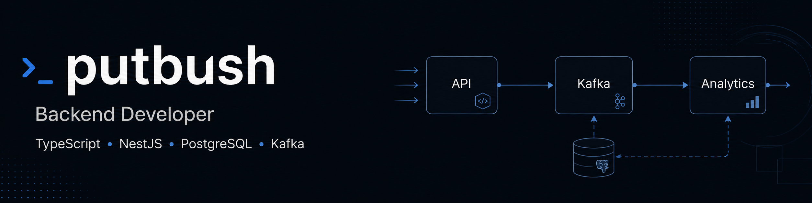

  

<h1 align="center">Илья, Backend-разработчик</h1>

  Санкт-Петербург · TypeScript · NestJS

## Обо мне

Backend-разработчик из Санкт-Петербурга. Основное направление — разработка серверных приложений на TypeScript и NestJS.

Работаю с PostgreSQL, MongoDB, Redis и Kafka. Изучаю микросервисную архитектуру, обработку событий и тестирование backend-приложений.

Также знаком с React и Next.js и могу использовать их для клиентской части проекта.

## Технологии

### Backend

  
  
  
  
  
  

### Базы данных и инфраструктура

  
  
  
  
  

### Тестирование и Frontend

  
  
  

 

<h2 align="center">Контакты</h2>

  
  &nbsp;
  

